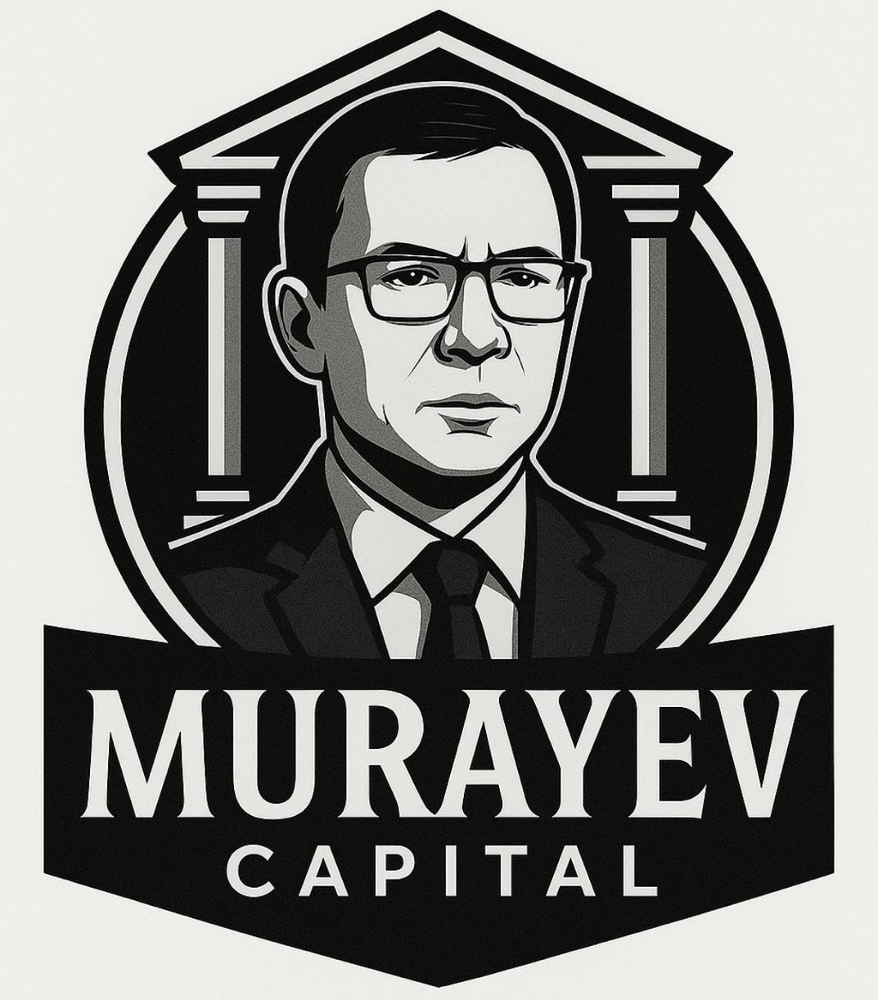

# Murayev Capital



Murayev Capital is a fan-driven token project supporting innovation in politics, technological progress, and justice. Built on the Solana blockchain, the MRV token represents a symbol of unity and accountability for a new wave of political thinking.

## 🚀 Features

- **Decentralized Forum**: A censorship-resistant platform for voting and democratic governance.
- **Tokenomics**: Transparent distribution with 30M total supply, designed for long-term value.
- **Security First**: Rug-pull protection, anti-scam measures, and transparent liquidity model.
- **Multilingual Support**: Fully localized in English and Ukrainian.
- **Modern UI**: High-end, premium design with smooth animations and responsive layouts.

## 🛠️ Tech Stack

- **Framework**: [Next.js 15+](https://nextjs.org/)
- **Styling**: [Tailwind CSS 4](https://tailwindcss.com/)
- **Components**: [Radix UI](https://www.radix-ui.com/) & [Shadcn UI](https://ui.shadcn.com/)
- **Icons**: [Lucide React](https://lucide.dev/)
- **Charts**: [Recharts](https://recharts.org/)
- **Fonts**: Custom localized fonts (NHL Phoenix, Milk RUS)

## 📦 Getting Started

### Prerequisites

- Node.js 18+
- npm / pnpm / yarn

### Installation

1. Clone the repository:
   ```bash
   git clone https://github.com/ayanmal1k/Murayev-Capital.git
   ```

2. Install dependencies:
   ```bash
   npm install
   ```

3. Run the development server:
   ```bash
   npm run dev
   ```

4. Open [http://localhost:3000](http://localhost:3000) in your browser.

## 🔗 Links

- **Website**: [murayevcapital.com](https://murayevcapital.com)
- **Forum**: [forum.online](https://forum.online/)
- **Telegram**: [@fan_club_MRV](https://t.me/fan_club_MRV)
- **Contract Address**: `4UUh7nEwB2CRj5MVbE26FBimuoazEGFGzydBykWypHWZ`

## 📄 License

© 2025 Murayev Capital. All Rights Reserved.
